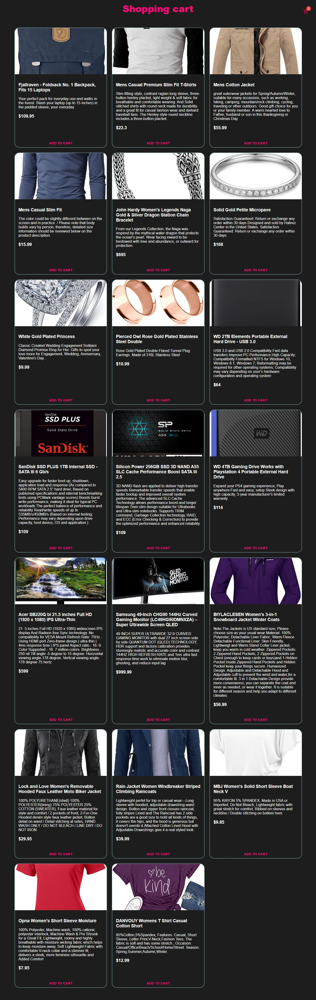
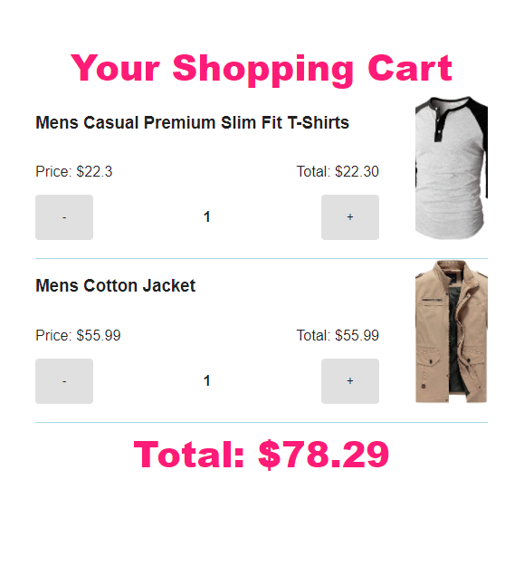

# Shopping Cart

## Features
   - If the user wants to buy a product, then the user has to click on add to cart.
   - The user's product will be added to the cart icon.
   - When a user clicks on the Cart icon, they can see what products they have purchased or added.
   - Then they will be able to see the details of the product.
   - Then they can add and remove their products as per their wish

## Technology
   - React
   - TypeScript
   - Material-UI
   - React-Query
   - Styled-Components

## Hosting Platform
   - Netlify

## ([Live Website](https://shopping-cart-srb.netlify.app/))

## User Interface(UI)

